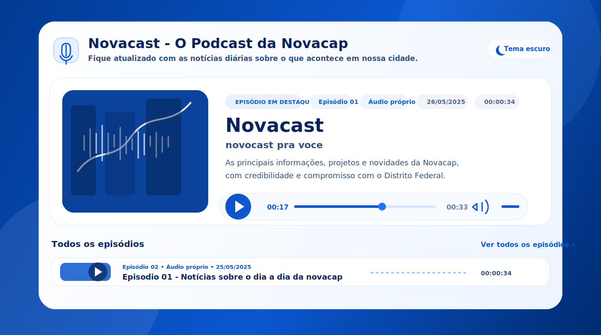

# Novacast

<p align="center">
  
</p>

Novacast é um plugin WordPress para gerenciar episódios de podcast e exibir players no frontend.

## Recursos atuais

- Cadastro de episódios no painel do WordPress.
- Custom Post Type `novacast_episode`.
- Campos para áudio próprio, YouTube, Spotify, duração, capa externa e status de exibição.
- Painel administrativo em cards interativos.
- Seleção visual da fonte de reprodução.
- Upload/seleção de áudio pela biblioteca de mídia no cadastro do episódio.
- Detecção automática da duração do áudio próprio.
- Player frontend via shortcode.
- Episódio mais recente em destaque no topo.
- Lista de episódios abaixo do destaque.
- Botão **Ver todos os episódios**.
- Alternância entre tema claro e escuro no frontend.
- Mini área com ícone de play, número do episódio, data e duração.
- Reprodução por áudio HTML5 para arquivos próprios.
- Reprodução por embeds oficiais do YouTube e Spotify.
- Tela **Novacast > Sincronização**.
- Sincronização manual com playlist pública do YouTube.
- Sincronização manual com show do Spotify.
- Seção frontend com título: **Novacast - O Podcast da Novacap**.
- Visual premium em azul e branco inspirado em plataformas de áudio.
- Preview visual em SVG no diretório `docs/`.

## Estrutura

```text
Novacast/
├── novacast.php
├── readme.txt
├── includes/
│   ├── class-novacast-post-type.php
│   ├── class-novacast-admin.php
│   ├── class-novacast-frontend.php
│   └── class-novacast-integrations.php
├── assets/
│   ├── css/
│   │   ├── novacast-admin.css
│   │   └── novacast-frontend.css
│   └── js/
│       ├── novacast-admin.js
│       └── novacast-player.js

docs/
└── novacast-premium-player.svg
```

## Instalação

1. Baixe ou clone este repositório.
2. Envie a pasta `Novacast` para `wp-content/plugins/`.
3. Ative o plugin no painel do WordPress.
4. Acesse **Novacast > Adicionar novo** para cadastrar episódios.
5. Acesse **Novacast > Sincronização** para configurar YouTube e Spotify.

## Shortcodes

Exibir os últimos episódios:

```text
[novacast_player]
```

Exibir até 5 episódios:

```text
[novacast_player limit="5"]
```

Exibir com tema escuro inicial:

```text
[novacast_player theme="dark"]
```

Exibir um episódio específico:

```text
[novacast_player id="123"]
```

## Observação sobre YouTube e Spotify

O Novacast não baixa áudio do YouTube ou Spotify. Ele importa metadados e exibe os players por meio dos embeds oficiais dessas plataformas.

## Versão

0.3.2
